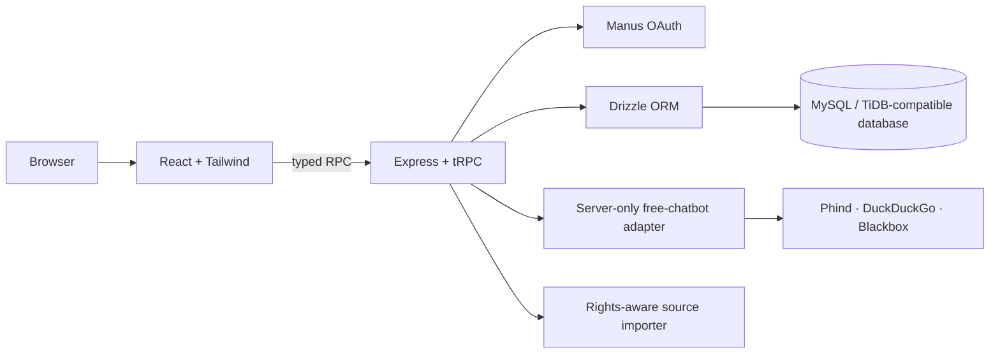

# Verbix

> A full-stack workspace for discovering, structuring, versioning, sharing, and running reusable AI prompts.

[](https://github.com/vincenzo-afk/verbix/actions/workflows/ci.yml) [](./LICENSE) [](https://www.typescriptlang.org/)

[Repository](https://github.com/vincenzo-afk/verbix) · [Report a bug](https://github.com/vincenzo-afk/verbix/issues/new?template=bug_report.yml) · [Request a feature](https://github.com/vincenzo-afk/verbix/issues/new?template=feature_request.yml) · [Security policy](./SECURITY.md)

---

## Table of contents

- [About](#about)
- [Capabilities](#capabilities)
- [Architecture](#architecture)
- [Technology stack](#technology-stack)
- [Getting started](#getting-started)
- [Usage](#usage)
- [API surface](#api-surface)
- [Project structure](#project-structure)
- [Testing](#testing)
- [Deployment](#deployment)
- [Contributing](#contributing)
- [Security](#security)
- [License](#license)

---

## About

Verbix makes reusable prompt work discoverable and manageable. Visitors can browse public prompts by category, tag, model compatibility, and discovery ranking. Authenticated creators can compose prompts, define exact `{{variable}}` tokens, preserve versions, enhance prompts through a server-side AI adapter, and deploy controlled prompt agents. Administrators moderate prompts, reviews, taxonomy, reports, source policies, and imported candidates.

Prompt improvement does not overwrite source work. Verbix stores the original prompt alongside an editable improved prompt and structured details covering intent, assumptions, missing information, constraints, variables, output format, acceptance criteria, and agent notes.

## Capabilities

| Area | Implemented capability |
| --- | --- |
| Prompt authoring | Creates prompts with title, description, body, modality, visibility, compatible models, and version history. |
| Variables | Parses exact `{{variable}}` tokens, validates typed values, compiles live previews, and exports text or JSON. |
| AI enhancement | Uses server-only `free-chatbot` provider fallbacks with bounded responses and an editable local fallback. |
| Discovery | Provides featured, trending, and recent sections with search plus category, tag, model, and sort filters. |
| Community | Supports saved prompts, ratings and reviews, reports, public creator profiles, and creator metrics. |
| Agents | Deploys owned prompts as shareable agents with server-side variable compilation and persisted hourly visitor rate limits. |
| Moderation | Enforces administrator-only controls for prompts, reviews, reports, categories, tags, source policies, imported candidates, and external output references. |
| Rights-aware imports | Processes reviewer-submitted public URLs from approved domains, applies network and `robots.txt` safeguards, preserves attribution, and stores media only as external references. |

## Architecture



The browser accesses typed procedures through `/api/trpc`. Server-side procedures enforce authentication, ownership, and administrator roles before writing to the database. The client bundle never calls AI providers directly.

## Technology stack

| Layer | Technology |
| --- | --- |
| Frontend | React `^19.2.1`, TypeScript `5.9.3`, Vite `^7.1.7`, Tailwind CSS `^4.1.14`, Wouter `^3.3.5` |
| Backend | Node.js, Express `^4.21.2`, tRPC `^11.6.0`, Zod `^4.1.12` |
| Data | Drizzle ORM `^0.44.5`, `mysql2` `^3.15.0`, MySQL/TiDB-compatible database |
| AI and extraction | `free-chatbot` `1.0.2`, Cheerio `^1.2.0` |
| Validation | Vitest `^2.1.4`, TypeScript compiler, Vite production build |

## Getting started

### Prerequisites

Install Node.js and pnpm. The repository declares pnpm `10.4.1` in its package-manager metadata and includes a pnpm lockfile.

| Variable | Purpose |
| --- | --- |
| `DATABASE_URL` | Connection string for the application database. |
| `VITE_APP_ID` | OAuth application identifier. |
| `JWT_SECRET` | Session signing secret and credential-vault key input. |
| `OAUTH_SERVER_URL` | OAuth service base URL. |
| `OWNER_OPEN_ID` | OAuth identity assigned the initial administrator role. |
| `BUILT_IN_FORGE_API_URL` | Built-in platform service base URL. |
| `BUILT_IN_FORGE_API_KEY` | Server-side built-in platform service credential. |
| `NODE_ENV` | `development` locally or `production` for a built server. |

```bash
git clone https://github.com/vincenzo-afk/verbix.git
cd verbix
pnpm install
pnpm dev
```

Database definitions reside in [`drizzle/schema.ts`](./drizzle/schema.ts). After changing a schema, generate a migration, review the SQL, and use the managed database workflow for the target environment.

```bash
pnpm drizzle-kit generate
```

## Usage

### Browse and use a prompt

1. Open **Discover** to search the public library or filter prompts.
2. Open a prompt detail page to inspect its content, variables, creator attribution, and approved external references.
3. Supply values for `{{variable}}` tokens. Verbix validates and compiles the prompt live.
4. Copy or export the result, save it, or run it through the authenticated AI workflow.

### Create and improve a prompt

1. Open **Compose** and enter the source prompt.
2. Include exact `{{variable}}` tokens for downstream user input.
3. Request an improvement; the original remains available and the result can be accepted as a new version.
4. Save the draft in **Workspace**, configure typed variables, and submit it for moderation when it is ready for public discovery.

### Import public prompt material

1. Submit a specific public HTTP(S) source URL in **Imports**.
2. An administrator approves the domain and provides its public terms or reuse-policy URL before fetching.
3. The importer applies address-resolution, redirect, content-type, size, and `robots.txt` safeguards.
4. Administrators review candidates and external output references, then promote approved candidates to the public library.

> Verbix does not bypass authentication, payments, access controls, or `robots.txt`; it does not copy externally hosted media.

## API surface

The application has typed tRPC procedures under `/api/trpc`, consumed by the React client through `@trpc/react-query`.

| Router | Selected procedures | Access |
| --- | --- | --- |
| `discovery` | `list`, `bySlug`, `creator`, `categories`, `tags`, `related`, `recordView` | Public |
| `workspace` | `mine`, `byId`, `create`, `saveVersion`, `variables`, `submit`, `toggleSave`, `review`, `report` | Authenticated; ownership enforced where applicable |
| `improvement` | `enhance`, `accept` | Mixed public and authenticated |
| `execution` | `run`, `history` | Authenticated |
| `agents` | `mine`, `create`, `publicBySlug`, `invoke` | Mixed; creation is ownership-gated |
| `credentials` | `list`, `set`, `remove` | Authenticated and user-scoped |
| `importer` | `mine`, `submitSource`, `ingest`, review and policy controls | Mixed; review and policy controls are administrator-only |
| `admin` | Moderation queue, reports, taxonomy, and moderation mutations | Administrator-only |

## Project structure

```text
verbix/
├── client/src/             # React pages, components, hooks, and routes
├── drizzle/                # Drizzle schema and generated migrations
├── docs/                   # Importer operations and policy documentation
├── server/_core/           # OAuth, tRPC, storage, and server bootstrap
├── server/routers/         # Domain-specific tRPC procedures
├── server/services/        # AI adapter, credential vault, and importer
├── server/db.ts            # Database persistence helpers
├── shared/                 # Shared constants, types, and errors
└── vitest.config.ts        # Node-based test configuration
```

## Testing

Run the full validation sequence before submitting a pull request:

```bash
pnpm test
pnpm check
pnpm build
```

Vitest covers prompt variables, AI response normalization and fallbacks, credential-vault behavior, importer safeguards, authorization boundaries, and router success paths. The CI workflow runs the same commands for pushes and pull requests targeting `main`.

## Deployment

```bash
pnpm build
pnpm start
```

Set all required variables in the target platform’s protected environment configuration. The Express server selects an available `PORT` at runtime and requires network access to the configured OAuth service and database.

## Contributing

Read [CONTRIBUTING.md](./CONTRIBUTING.md) for the development workflow and [CODE_OF_CONDUCT.md](./CODE_OF_CONDUCT.md) for community standards. Do not submit secrets, personal data, fabricated user content, or material that violates source rights.

## Security

Read [SECURITY.md](./SECURITY.md) before reporting a vulnerability. Do not publish sensitive security details in a public issue.

## License

Verbix is distributed under the [MIT License](./LICENSE). Copyright © 2026 BHARANI KUMAR S.

## Acknowledgments

Verbix uses [React](https://react.dev/), [tRPC](https://trpc.io/), [Drizzle ORM](https://orm.drizzle.team/), [Vite](https://vite.dev/), [Tailwind CSS](https://tailwindcss.com/), and [`free-chatbot`](https://www.npmjs.com/package/free-chatbot).

<p align="right">(<a href="#verbix">back to top</a>)</p>
